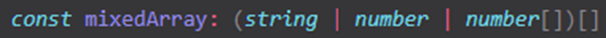

<div align="center"><h1><b>Les tableaux et les objets</b></h1></div>

Les tableaux sont des objets spéciaux en JavaScript. Avec des méthodes spéciales qui permettent de faire des choses plus facilement grâce à cette forme de tableau.


## Les tableaux
**Tableau de chaînes de caractères**
```ts
// Ce tableau n'accepte que les chaîne de caractères
const fruits = ['fraise', 'pomme']
fruits.push("cerises")
console.log(fruits);
```

**Tableau mixte** 

```ts
// tableau mixé
const mixedArray = [1, 'txt', [1,2,3]]
```

**Tableau de nombre**
```ts
let nums : number []; // prend un tableau de nombres
// nums.push(1) ne fonctionne pas car le tableau n'existe pas encore
nums= [1,2?3]
// instancier un tableau vide
let nums2 : number [] = []
nums2.push(2) // possible car il est créé
```

Tableau qui reçoit tout (type `any`)
```ts
let random
random [1, true, 10]
random = true // les booléens ne sont pas obligatoirement dans un tableau

let random : any []; 
random = [true, false, true]
```

## Les objets
Objet dont les propriétés ont un type inféré
```ts
const car = {
    name: "Audi",
    model: "A1",
    km: 70000
}
// car.name = 4 // il attend une chaîne de caractère
```
Variable qui prend que des objets
```ts
let profile : {
    name: string, 
    age: number,
    hobbies: string[]
}

profile = {} // erreur car il n'y a pas d'objet

profile = {
    name: "John",
    age: 85,
    hobbies: []
}

/* autre méthode peu utilisée (et pas jolie) car il existe les types personnalisés
qui permettent de créer des objets directement et aussi des interfaces pour créer
des objets avec certains types, ... qui vont ajouter des fonctionnalités */
let user : {
    name: string,
    age: number,
    favFood: string[],
    data: any
} = {
    name: "Joe",
    age: 45,
    favFood: ['pasta', 'cheese'],
    data: 50
}
```
Variable qui ne prend que les objets
```ts
let obj: object;

obj = {name: "Enzo"}
obj = 10 // faux
```