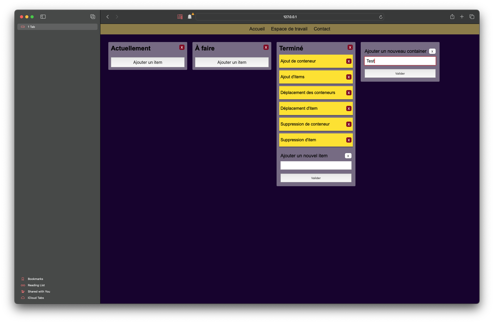

# **Clone de Trello** 

Le projet a ces fonctionnalités :
* Ajouter des conteneurs ;
* Ajouter des items ;
* Déplacer les items dans le conteneur parent et dans les autres ;
* Déplacer les conteneurs ;
* Supprimer les items ;
* Supprimer tous les conteneurs y compris ceux d'origines.

